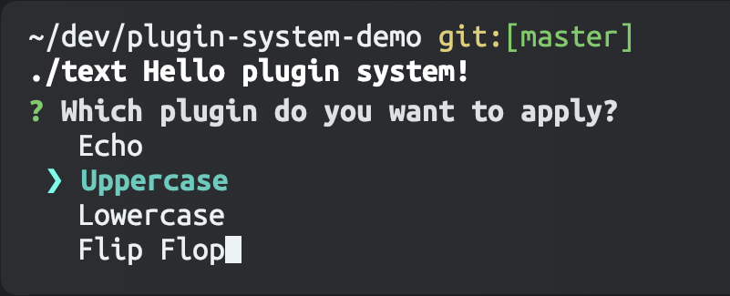

# Plugin System Demo

A simple console application that demonstrates the use of a plugin system. The application transforms an input text using plugins that are loaded at runtime. The user can browse the available plugins from the command line and select the one to apply.




The plugin mechanism relies on the [ServiceLoader](https://docs.oracle.com/en/java/javase/22/docs/api/java.base/java/util/ServiceLoader.html) facility introduced in Java 6.
The CLI interface is implemented using [Kotlin Inquirer](https://github.com/kotlin-inquirer/kotlin-inquirer).

To build and run the application, use the `text` script:
```sh
./text Hello plugin system!
```
